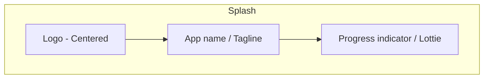
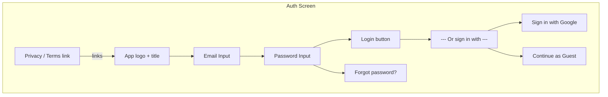

# Wireframes chi tiết - ReceiptApp

File này chứa wireframe chi tiết cho từng màn của app, vẽ bằng Mermaid. Mỗi `code block` mermaid mô tả cấu trúc layout (component chính) của một screen.

> Lưu ý: VS Code không render mermaid mặc định. Để xem sơ đồ trong VS Code, cài extension như `Markdown Preview Mermaid Support` hoặc `Markdown Preview Enhanced`. Hoặc dán đoạn mermaid vào https://mermaid.live/ để render.

---

## 1) Splash / Launcher

- Thành phần: logo, tên app, animation/loader.
- Hành vi: chuyển tiếp (timeout) -> Onboarding hoặc Login/Home.

## 2) Onboarding (slide ngang)
```mermaid
flowchart TB
  subgraph ONB[Onboarding - Pager]
    Logo[Small logo]
    Slide1[Title + Short description + Image]
    Slide2[Title + Short description + Image]
    Slide3[Title + Short description + Image]
    Controls[Prev | PageDots | Next]
    CTA[Get Started (button)]
  end
  Logo --> Slide1 --> Slide2 --> Slide3
  Slide3 --> CTA
  Controls -.-> Slide1
```
- Mỗi slide: hình minh họa, tiêu đề, mô tả ngắn. Cuối cùng có nút `Get Started`.

## 3) Auth - Login / Guest

- Hỗ trợ OAuth (Google) và chế độ khách để trải nghiệm nhanh.

## 4) Home - List Receipts
```mermaid
flowchart TB
  subgraph HOME[Home - Receipts List]
    TopBar[TopAppBar: Title | Search icon | Filter icon | Overflow]
    FilterRow[Chips: All | This Month | Categories]
    List[LazyColumn]
    Item[ReceiptItem: Thumbnail | Vendor | Date | Amount | Category Tag]
    EmptyState[Empty: Illustration + CTA Add Receipt]
    FAB[Floating Action Button (Add)]
    BottomNav[optional BottomNav: Home | Reports | Settings]
  end
  TopBar --> FilterRow --> List
  List --> Item
  List --> EmptyState
  HOME --> FAB
  HOME --> BottomNav
```
- `ReceiptItem` có thumbnail (ảnh hoá đơn nhỏ), tiêu đề, ngày, số tiền, tag category.
- FAB mở `Add Receipt`.

## 5) Receipt Details
```mermaid
flowchart TB
  subgraph DETAIL[Receipt Detail]
    TopBar[Back | Title | More options]
    Photo[Large Image (swipe/zoom)]
    KeyData[Row: Vendor | Date | Total]
    Fields[Card list: Category | Notes | Payment Method]
    Actions[Buttons: Edit | Delete | Export PDF | Share]
    OCRPanel[Optional: recognized text blocks]
  end
  TopBar --> Photo --> KeyData --> Fields --> Actions
  Photo -.-> OCRPanel
```
- Cho phép zoom ảnh, highlight OCR results (tap -> copy).

## 6) Add Receipt (choose method)
```mermaid
flowchart TB
  subgraph ADD[Add Receipt - Choose]
    TopBar[Back | Title]
    Options[Buttons: Scan (Camera) | Upload (Gallery) | Manual Entry]
    ScanFlow[Scan flow: Camera preview -> Capture -> Crop -> OCR -> Confirm]
    UploadFlow[Pick image -> Crop -> OCR -> Confirm]
    ManualFlow[Form: Vendor | Date | Amount | Category | Notes]
  end
  Options --> ScanFlow
  Options --> UploadFlow
  Options --> ManualFlow
```
- Scan/Upload flows integrate OCR then show pre-filled form for user review.

## 7) Reports / Charts
```mermaid
flowchart TB
  subgraph REPORTS[Reports]
    TopBar[Title | Date range selector]
    Summary[Cards: Total spend | Avg per month | Top categories]
    Chart[Bar/Line/Pie using MPAndroidChart/ComposeCharts]
    ExportBtn[Export CSV / PDF]
  end
  TopBar --> Summary --> Chart --> ExportBtn
```
- Cho phép chọn range (Last month / Custom) và export dữ liệu.

## 8) Settings
```mermaid
flowchart TB
  subgraph SETTINGS[Settings]
    TopBar[Back | Settings]
    Account[Account: profile, logout]
    Theme[Theme: Light / Dark / System]
    Backup[Backup & Restore: Local / Cloud]
    Security[PIN / Biometric lock]
    About[About | Privacy | Terms]
  end
  TopBar --> Account --> Theme --> Backup --> Security --> About
```

---

## Ghi chú UI pattern & accessibility
- Dùng `TopAppBar` tiêu chuẩn, `FAB` cho hành động chính.
- Sử dụng `LazyColumn` cho hiệu suất danh sách lớn.
- Thêm `contentDescription` cho ảnh và icon; đảm bảo kích thước target (48dp) cho touch targets.
- Hỗ trợ font scaling và contrast (Material3 theme đã có).

## Tiếp theo (gợi ý thực thi nhanh)
- Tôi có thể scaffold các Compose screens mẫu theo wireframes ở trên (tạo `HomeScreen`, `DetailScreen`, `AddScreen`, `ReportsScreen`, `SettingsScreen`, và `NavGraph`).
- Muốn tôi tạo scaffold code không? (gõ `Có` hoặc `Tạo code` để tôi bắt đầu)

---

File đã tạo: `docs/wireframes.md`

---

## Ví dụ wireframe dạng ASCII (Profile / Sign In)

Dưới đây là ví dụ wireframe theo kiểu ASCII bạn gửi — dễ đọc trong Markdown mà không cần extension:

```
 ┌─────────────────────────────────────────────────┐
 │  Profile 0% complete                              │
 │  ░░░░░░░░░░ 0/3                                   │
 │  Complete: None                                    │
 └─────────────────────────────────────────────────┘
 │
 │  ┌─────────────────────────────────────────────────┐
 │  │  [👤 Default Avatar]  │  Sign In                  │
 │  │  (No change btn)     │  (Click to sign in)        │
 │  │                      │                            │
 │  │  (Row layout: Avatar left, Sign In text right)   │
```

Gợi ý sử dụng trong UI:
- Box trên cùng: progress summary của profile (progress bar + status)
- Hàng dưới: row chứa avatar bên trái và call-to-action `Sign In` bên phải
- Dùng monospace code block để render chính xác trong Markdown

Bạn muốn tôi chuyển toàn bộ wireframes mermaid sang kiểu ASCII như thế này không, hay chỉ một vài màn cụ thể?